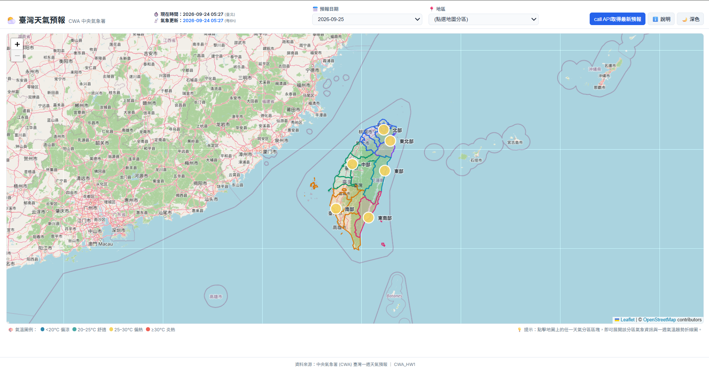
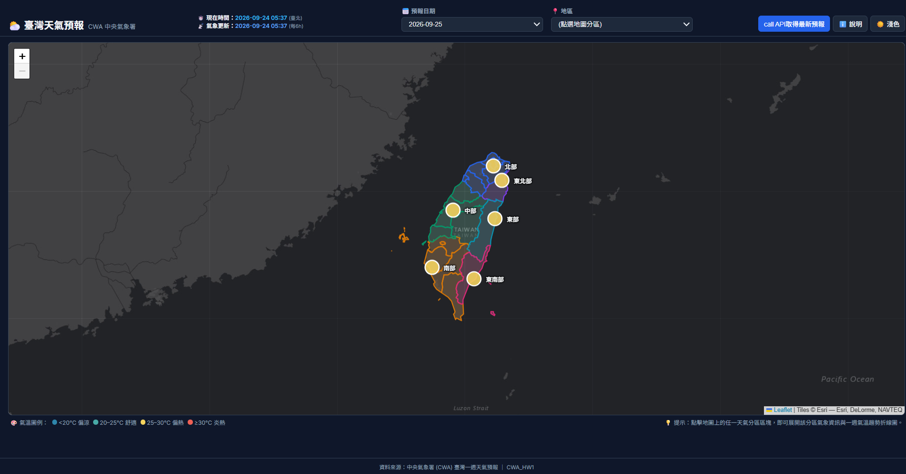

# 🌤️ 臺灣天氣預報應用程式 (Taiwan Weather Forecast)

> **從中央氣象署開放資料到全方位互動式氣象儀表板**  
> *資料擷取 (ETL) · 空間資料庫 (SQLite) · 資料視覺化 (Folium / Leaflet) · 雙版本展示 (Streamlit + Vercel)*

[](https://cwahw1-ten.vercel.app/)
[](https://streamlit.io/)
[](https://www.python.org/)
[](https://opendata.cwa.gov.tw/)
[](https://www.sqlite.org/)

---

## 🌐 線上即時展示 (Live Demo)

🔗 **Vercel 線上部署版**：[https://cwahw1-ten.vercel.app/](https://cwahw1-ten.vercel.app/)

本專案提供無需本機安裝即可在瀏覽器體驗的線上版本，具備完整的臺灣六大分區氣溫地圖、深淺色主題切換、七日氣溫走勢圖以及即時 CWA API 連線更新功能。

### 淺色模式


### 深色模式

---

## 📖 專案簡介與核心特色 (Introduction & Features)

本專案對接交通部中央氣象署 (CWA) 開放資料 API，自動獲取並處理臺灣未來一週逐 12 小時預報資料，經過空間與統計聚合後，呈現六大氣象分區之溫度、天氣現象與降雨機率。

### 核心功能亮點
1. **雙架構版本支援 (Two Deployment Models)**：
   * **本機桌面端 (Streamlit)**：基於 SQLite 資料庫與 Folium 打造，支援完整的本地資料持久化、事務寫入與安全更新機制。
   * **雲端網頁端 (Vercel)**：基於 Serverless Functions (Python) 與純前端靜態頁面 (Leaflet.js + Chart.js)，零外部資料庫依賴，適合輕量快速部署。
2. **臺灣六大分區精確聚合**：
   * 整合全臺 22 縣市資料，劃分北部、中部、南部、東北部、東部、東南部六大氣象分區。
   * 數值氣溫取平均值（保留一位小數）；天氣現象採眾數 (Mode) 統計；降雨機率採縣市有效預報加權平均。
3. **沉浸式空間視覺化 (Interactive Map)**：
   * 整合 GeoJSON 分區邊界，支援 Hover 高亮與點擊互動。
   * 依據平均溫度分級套色：偏涼 (<20°C 藍)、舒適 (20–25°C 綠)、偏熱 (25–30°C 黃)、炎熱 (≥30°C 紅)。
   * **雙主題地圖底圖**：淺色模式採用 OpenStreetMap；深色模式採用 Esri `World_Dark_Gray_Base`。
4. **即時新鮮度檢查與手動安全更新**：
   * 內建 6 小時自動過期判定，支援按鈕一鍵手動向 CWA API 請求最新數據。
   * 嚴密防護：若 API 連線異常或回傳資料不完整，系統自動維持既有資料，絕不損毀資料庫或造成空白頁面。

---

## 📂 專案檔案結構與職責清單 (Project Structure)

專案包含本機 Streamlit 應用程式與雲端 Vercel Serverless 網頁應用程式，兩者共享核心資料爬取與解析邏輯。

```text
0923/
├── api/
│   └── weather.py            # [Vercel] Python Serverless API 端點
├── public/
│   ├── index.html            # [Vercel] 靜態網頁骨架與排版
│   ├── style.css             # [Vercel] 深淺色主題與自適應樣式
│   ├── app.js                # [Vercel] 前端互動、Leaflet 地圖與 Chart.js 圖表邏輯
│   └── taiwan_regions.geojson# [Vercel] 前端載入之六大分區邊界向量圖
├── app.py                    # [Streamlit] 本機 Streamlit 主程式
├── database.py               # [Streamlit] SQLite 資料表建立、資料寫入事務與驗證查詢
├── data.db                   # [Streamlit] 本機 SQLite 預報資料庫 (本機產生，不列入 Git)
├── checkdb.py                # [Streamlit] 資料庫快速查詢測試腳本
├── fetch_weather.py          # [Shared] CWA API 網路連線與資料抓取模組
├── parse_weather.py          # [Shared] 原始 JSON 解析與六大分區聚合演算法
├── weather_service.py        # [Shared] 集中式更新流程、資料新鮮度檢查與標準化輸出
├── taiwan_regions.geojson    # [Shared] 臺灣六大氣象分區 GeoJSON 原始定義檔
├── weather_raw.json          # [Shared] CWA API 原始回應 JSON 備份檔
├── requirements.txt          # [Shared] Python 依賴套件清單
├── vercel.json               # [Vercel] Vercel 路由與構建設定檔
├── .env                      # [Shared] 本地環境變數與私密金鑰 (嚴禁提交至 Git)
├── .env.example              # [Shared] 環境變數配置範例範本
├── .gitignore                # [Documentation/Configuration] Git 版本控制忽略清單
├── README.md                 # [Documentation/Configuration] 專案完整說明文件
└── workflow.md               # [Documentation/Configuration] 專案完整實作與開發歷程紀錄
```

### 檔案用途與分類對照表

| 檔案路徑 | 分類標籤 | 核心職責與用途說明 |
| :--- | :---: | :--- |
| `app.py` | **Streamlit** | Streamlit 應用程式進入點；負責使用者介面、Folium 地圖整合、Matplotlib 走勢圖與側邊欄面板。 |
| `database.py` | **Streamlit** | 管理 SQLite (`data.db`) 連線、`TemperatureForecasts` 與 `SyncMetadata` 資料表初始化及事務寫入。 |
| `data.db` | **Streamlit** | 本地 SQLite 實體資料庫檔案；存放清洗後的氣象預報記錄。 |
| `checkdb.py` | **Streamlit** | 開發階段除錯腳本；用於快速執行 SQL 查詢確認南部地區預報數據。 |
| `api/weather.py` | **Vercel** | Vercel Serverless Function；在伺服器端調用爬取與解析邏輯，提供 `/api/weather` REST 端點，隔離 API 金鑰。 |
| `public/index.html` | **Vercel** | Vercel 部署之前端入口頁面；包含頂部控制列、地圖容器、資訊面板與彈窗結構。 |
| `public/style.css` | **Vercel** | 純 CSS 樣式表；完整實現淺色與深色主題切換、響應式佈局與按鈕微動畫。 |
| `public/app.js` | **Vercel** | 前端核心邏輯；負責呼叫 API、驅動 Leaflet 地圖、更新色標 Marker 與繪製 Chart.js 七日折線圖。 |
| `public/taiwan_regions.geojson` | **Vercel** | 放置於靜態公開目錄的分區邊界向量圖檔，供 Leaflet 進行非同步讀取繪製。 |
| `vercel.json` | **Vercel** | Vercel 平台路由重寫規則設定；將 `/api/*` 導向 Python 函數，其餘請求導向 `public/`。 |
| `fetch_weather.py` | **Shared** | 負責發起 HTTP 請求至中央氣象署 Open Data API，並包含自動容錯降級機制。 |
| `parse_weather.py` | **Shared** | 解析 CWA 複雜巢狀 JSON 結構，執行六大分區的高低溫、降雨機率與天氣現象眾數聚合。 |
| `weather_service.py` | **Shared** | 業務邏輯服務層；串聯抓取、解析、入庫及 6 小時資料新鮮度排程判定。 |
| `taiwan_regions.geojson` | **Shared** | 臺灣六大分區 GeoJSON 空間數據，供本機 Streamlit 載入繪圖。 |
| `weather_raw.json` | **Shared** | CWA API 原始回應之本地快取備份，便於離線測試與解析驗證。 |
| `requirements.txt` | **Shared** | 宣告 Python 執行環境所需套件版本清單。 |
| `.env` | **Shared** | 儲存本機執行的私密 API Key；受 `.gitignore` 保護，絕不公開。 |
| `.env.example` | **Shared** | 提供給協作者或部署環境的環境變數設定範本。 |
| `.gitignore` | **Documentation/Configuration** | 定義 Git 排除追蹤之檔案（如 `.env`, `data.db`, `__pycache__/`）。 |
| `README.md` | **Documentation/Configuration** | 專案介紹、架構說明、檔案導覽與本機/雲端部署指南。 |
| `workflow.md` | **Documentation/Configuration** | 專案開發歷程、實作階段里程碑、技術選型與問題解決復盤報告。 |

---

## ⚙️ 環境變數配置 (Environment Variables)

本專案嚴格遵循安全性規範，**所有 API 金鑰均保存在環境變數中，絕不寫死於程式碼或暴露給前端**。

請參考 [`.env.example`](file:///c:/Users/yuwen/Downloads/0923-main/0923/.env.example) 建立本機 [`.env`](file:///c:/Users/yuwen/Downloads/0923-main/0923/.env) 檔案：

```ini
# 中央氣象署開放資料平臺 API 授權碼 (必填)
CWA_API_KEY=YOUR_CWA_API_KEY_HERE

# 資料集 ID (選填，預設為 F-D0047-091)
CWA_DATASET_ID=F-D0047-091

# 自動更新檢查週期 (選填，預設 6 小時)
CWA_REFRESH_INTERVAL_HOURS=6
```

> **取得 API Key 方式**：前往 [中央氣象署氣象資料開放平臺](https://opendata.cwa.gov.tw/) 免費註冊帳號，於會員專區取得個人授權碼。

---

## 💻 本機執行指南：Streamlit 應用程式

### 步驟 1：建立並啟用虛擬環境
```bash
# 建立虛擬環境
python -m venv venv

# Windows 啟用
venv\Scripts\activate

# macOS / Linux 啟用
source venv/bin/activate
```

### 步驟 2：安裝相依套件
```bash
pip install -r requirements.txt
```

### 步驟 3：設定 API 金鑰
於專案根目錄新增 `.env` 檔案並填入您的 `CWA_API_KEY`。

### 步驟 4：初始化資料庫 (可選)
如需預先建立資料庫並填入初次資料，可執行：
```bash
python database.py
```

### 步驟 5：啟動 Streamlit
```bash
streamlit run app.py
```
啟動後，瀏覽器將自動開啟 `http://localhost:8501`。使用者可在介面中查看臺灣分區地圖、點選區塊展開七日氣象折線圖，或點擊「🔄最新預報」透過後端安全更新資料庫。

---

## ☁️ 雲端架構與 Vercel 部署 (Vercel Architecture)

### 架構設計理念
Vercel 屬於無伺服器 (Serverless) 架構，其執行環境具有「短暫存續 (Ephemeral)」與「檔案系統唯讀」的特性，不適合本機 SQLite 資料庫的持續寫入。因此本專案規劃了極簡且高相容的無狀態架構：

1. **後端無狀態 API (`api/weather.py`)**：
   * 採用 Python 原生 `http.server.BaseHTTPRequestHandler` 實現輕量 Serverless 函數。
   * 直接重用 `fetch_weather.py` 與 `parse_weather.py`，於記憶體中即時完成資料抓取、聚合與結構化。
   * 透過 Vercel Project Settings 設定 `CWA_API_KEY`，確保前端瀏覽器完全無法觸及金鑰。
2. **前端靜態呈現 (`public/`)**：
   * 使用標準 HTML5、Vanilla CSS 與 JavaScript。
   * 地圖採用 **Leaflet.js**（Folium 的底層引擎），支援淺色 OSM 底圖與深色 Esri `World_Dark_Gray_Base` 底圖無縫切換。
   * 折線圖採用 **Chart.js**，提供平滑流暢的溫度走勢圖與 Tooltip。
3. **快取與更新機制**：
   * 伺服器端實施實例內記憶體快取與 HTTP Cache-Control 標頭（預設快取 6 小時）。
   * 當使用者在網頁點選「call API取得最新預報」時，前端送出帶有 `?force=1` 之請求，繞過快取即時取得中央氣象署最新預報。

### 部署至 Vercel 步驟
1. 將程式碼推送到 GitHub 儲存庫。
2. 登入 [Vercel](https://vercel.com/)，點選 **Add New Project** 並匯入該儲存庫。
3. 在 **Settings → Environment Variables** 新增：
   * Name: `CWA_API_KEY`
   * Value: `<您的中央氣象署授權碼>`
4. 點選 **Deploy**，幾分鐘內即完成自動構建與全球上線。

---

## 📜 授權與資料來源聲明
* **資料來源**：交通部中央氣象署 (CWA) 開放資料平臺 `F-D0047-091`「臺灣各縣市未來 1 週逐 12 小時天氣預報」。
* **底圖版權**：
  * Light Mode: © [OpenStreetMap](https://www.openstreetmap.org/copyright) contributors.
  * Dark Mode: Tiles © [Esri](https://www.esri.com/) — Esri, DeLorme, NAVTEQ.
