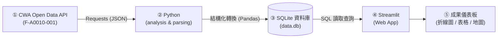

# 🌤️ HW10：Taiwan Weather Forecast (台灣天氣預報應用程式)

> **從氣象資料到互動式天氣預報應用程式**  
> *資料獲取 · 資料分析 · 資料儲存 · 資料查詢 · 視覺化展示*  
> *用程式探索天氣 · 用資料看見台灣 · 用程式連結真實世界，讓資料說出天氣的故事！*

[](https://www.python.org/)
[](https://opendata.cwa.gov.tw/)
[](https://www.sqlite.org/)
[](https://streamlit.io/)
[](https://python-visualization.github.io/folium/)

---

## 🎯 作業目標與學習成果 (Learning Objectives)

本專案為 **HW10 Taiwan Weather Forecast** 實作成果。串聯氣象開放資料與現代化 Python 資料處理技術，達成以下核心能力：

- [x] **學會使用 Open Data API**：向中央氣象署 (CWA) 呼叫 RESTful API 取得 JSON 格式天氣預報。
- [x] **掌握 JSON 資料結構分析**：剖析多層巢狀 Dictionary / List 結構，精準擷取高低溫數據。
- [x] **建立 SQLite 資料庫**：正規化設計資料表，使用 SQL 進行資料儲存與查詢驗證。
- [x] **使用 Streamlit 製作互動式 Web App**：打造下拉選單、走勢折線圖與動態資料表格。
- [x] **空間資訊視覺化 (加分功能)**：整合 Folium 繪製全台各區平均溫度色標互動地圖。

---

## 📊 作業要求與評分標準 (Grading Rubric)

| 大項 | 核心目標 | 配分 | 細部評分要點 |
| :--- | :--- | :---: | :--- |
| **任務 1：取得 CWA API 資料** | 使用 CWA API 取得台灣六大區域一週天氣預報（JSON 格式） | **20%** | • 取得資料 (10%)<br>• 觀察 JSON (5%)<br>• 程式品質 (5%) |
| **任務 2：分析 JSON，提取氣溫資料** | 解析 JSON 結構，擷取各地區每日 `MinT`（最低溫）與 `MaxT`（最高溫） | **20%** | • 提取正確 (10%)<br>• 觀察資料 (5%)<br>• 程式品質 (5%) |
| **任務 3：存入 SQLite 資料庫** | 設計 `TemperatureForecasts` 資料表並將預報資料寫入 `data.db` | **20%** | • 儲存資料 (10%)<br>• 查詢驗證 (5%)<br>• 程式品質 (5%) |
| **任務 4：Streamlit 氣溫預報 Web App** | 讀取 SQLite 資料庫，提供分區下拉選單、繪製折線圖與一週資料表 | **40%** | • 下拉選單 (10%)<br>• 折線圖與表格 (15%)<br>• SQLite 查詢 (10%)<br>• 程式品質 (5%) |
| **任務 5：進階地圖視覺化 (Optional)** | 整合 Folium 繪製互動式地圖，按均溫動態套色與資訊浮動卡片 | **加分項** | • 四色溫標分類<br>• 地圖 Marker 與 Popup 互動 |

---

## 🔄 系統架構與資料處理管線 (Data Pipeline)



---

## 🗺️ 涵蓋之台灣六大區域 (Target Regions)

本專案完整支援中央氣象署預報劃分之台灣六大分區：
1. **北部地區**
2. **中部地區**
3. **南部地區**
4. **東北部地區**
5. **東部地區**
6. **東南部地區**

---

## 🗄️ 資料庫結構設計 (Database Schema)

資料庫採用 SQLite（檔案名：`data.db`），建立 `TemperatureForecasts` 資料表：

### 資料表綱要 (DDL)
```sql
CREATE TABLE IF NOT EXISTS TemperatureForecasts (
    id INTEGER PRIMARY KEY AUTOINCREMENT,
    regionName TEXT NOT NULL,       -- 地區名稱（例：中部地區、北部地區）
    dataDate TEXT NOT NULL,         -- 預報日期（格式：YYYY-MM-DD）
    mint REAL NOT NULL,             -- 當日最低氣溫 (°C)
    maxt REAL NOT NULL              -- 當日最高氣溫 (°C)
);
```

### 資料提取結構範例 (Preview)
| regionName | dataDate | mint | maxt |
| :--- | :---: | :---: | :---: |
| 北部地區 | 2026-04-14 | 18 | 26 |
| 中部地區 | 2026-04-14 | 20 | 30 |
| 南部地區 | 2026-04-14 | 22 | 31 |

### 必備驗證查詢 (Verification Queries)
```sql
-- 1. 列出資料庫中所有不重複地區名稱
SELECT DISTINCT regionName FROM TemperatureForecasts;

-- 2. 查詢特定地區（如：中部地區）之一週氣溫預報
SELECT * FROM TemperatureForecasts WHERE regionName = '中部地區';
```

---

## 🖥️ Streamlit 互動介面功能 (Web App Specification)

### 1. 下拉選單選擇地區
- 透過 `st.selectbox("Select Region", regions)` 提供六大分區動態切換。
- 選取後觸發 SQL 查詢：`SELECT dataDate, mint, maxt FROM TemperatureForecasts WHERE regionName = ?`

### 2. 一週最高與最低溫折線圖
- X 軸：日期區間（7 天預報，如 `04/14 ~ 04/20`）。
- Y 軸：氣溫數值（`10°C ~ 40°C`）。
- 雙線走勢：
  - 🔴 **MaxT**：最高氣溫折線
  - 🔵 **MinT**：最低氣溫折線

### 3. 一週數據明細表
- 欄位包含：`Date` (預報日期)、`MinT` (最低溫)、`MaxT` (最高溫)。
- 清楚呈現一週每日氣溫細節。

---

## 🗺️ 進階加分功能：台灣地圖視覺化 (Folium Map)

在 Web App 整合互動式台灣地圖，在地圖上標記六大區域中心點，並依照該日**平均氣溫**（`(MinT + MaxT) / 2`）動態呈現對應色塊：

| 氣溫範圍 | 代表色標 | 視覺意義 |
| :---: | :---: | :--- |
| `< 20°C` | 🔵 藍色 | 偏冷 / 需添衣保暖 |
| `20 ~ 25°C` | 🟢 綠色 | 舒適宜人 |
| `25 ~ 30°C` | 🟡 黃色 | 溫暖偏熱 |
| `> 30°C` | 🔴 紅色 | 酷熱高溫 |

- **點擊彈窗互動 (Popup)**：點擊標記點可查看地區名稱、日期與當日之最低溫 / 最高溫資訊。

---

## 📂 建議專案結構 (Project Structure)

```text
HW10_weather/
├── fetch_weather.py      # 任務 1：呼叫 CWA API 取得原始 JSON 資料
├── parse_weather.py      # 任務 2：分析 JSON 結構，擷取各地區 MinT / MaxT 氣溫數據
├── database.py           # 任務 3：建立 SQLite data.db 與 TemperatureForecasts 資料表
├── app.py                # 任務 4 & 5：Streamlit 互動 Web 應用與 Folium 地圖呈現
├── data.db               # SQLite 本地資料庫檔案（由腳本執行生成）
├── weather_data.csv      # (可選) 中間產物，方便除錯檢驗
├── requirements.txt      # 專案依賴套件清單
├── .env.example          # 環境變數設定範例
├── .gitignore            # Git 忽略清單（排除 .env, data.db 等）
└── README.md             # 本專案完整說明文件
```

---

## 🚀 快速開始與執行步驟 (Quick Start)

### 步驟 1：建立與啟動虛擬環境 (建議)

```bash
# 建立虛擬環境
python -m venv venv

# Windows 啟動
venv\Scripts\activate

# macOS / Linux 啟動
source venv/bin/activate
```

### 步驟 2：安裝必要套件

```bash
pip install -r requirements.txt
```

> **必要套件清單 (`requirements.txt`)**：
> - `requests`
> - `pandas`
> - `streamlit`
> - `folium`
> - `streamlit-folium`
> - `python-dotenv`

### 步驟 3：設定 CWA API Key

1. 至 [中央氣象署氣象資料開放平臺](https://opendata.cwa.gov.tw/) 登入並取得個人專屬授權碼。
2. 建立 `.env` 檔案並填入金鑰：
   ```ini
   CWA_API_KEY=YOUR_CWA_API_KEY_HERE
   ```

### 步驟 4：執行資料處理 (一次即可)

依序執行資料爬取、解析與存庫腳本：

```bash
python fetch_weather.py
python parse_weather.py
python database.py
```
> 執行完成後，將在目錄生成 `data.db`，且內含完整六大分區之一週預報。

### 步驟 5：啟動 Web App

```bash
streamlit run app.py
```
啟動後於瀏覽器開啟 `http://localhost:8501` 即可瀏覽互動式天氣預報儀表板！

---

## ⚠️ 重要注意事項 (Submission Checklist)

1. 🔑 **金鑰規範**：請務必使用**自己申請的 CWA API Key**，切勿使用他人或教師提供的金鑰繳交。
2. 🚫 **架構規範**：**Streamlit 必須從 SQLite 查詢資料**，不可在 Streamlit 應用程式中直接呼叫 CWA API。
3. 📍 **完整區域**：確認六個分區（北部、中部、南部、東北部、東部、東南部）資料皆已完整入庫。
4. 📅 **資料週期**：圖表與表格需完整呈現一週（7 天）預報資料。
5. 🌟 **進階選做**：台灣地圖視覺化為加分功能，請先確保 1~4 項核心功能運作無誤後再行實作。

---

*用程式連結真實世界，讓資料說出天氣的故事！*
