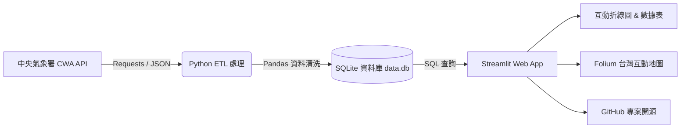

# ☀️ AI 創新微課程：Taiwan Weather Forecast (台灣天氣預報互動應用)

> **從氣象資料到互動式天氣預報應用**  
> *用程式探索天氣 · 用資料看見台灣 · 用 AI 實現更多可能*  
> *Code Smarter, Build a Better Tomorrow!*

[](https://www.python.org/)
[](https://streamlit.io/)
[](https://www.sqlite.org/)
[](https://pandas.pydata.org/)
[](https://python-visualization.github.io/folium/)
[](https://opendata.cwa.gov.tw/)

---

## 📖 專案簡介 (Overview)

本專案為 **AI 創新微課程** 之實作成果專案——**Taiwan Weather Forecast（台灣天氣預報應用）**。由 **煥哥** 帶領，結合理論與實務，從台灣中央氣象署（CWA）Open Data API 串接開始，歷經 JSON 解析、Pandas 資料前處理、SQLite 結構化資料庫持久化，到最終利用 Streamlit 與 Folium 打造出具備互動圖表與地理視覺化的現代化天氣儀表板（Weather Dashboard）。

> 「技術可以解決問題，但更重要的是用技術創造更好的未來！」 —— 煥哥

---

## 🌟 核心特色 (Key Features)

- **實時資料串接**：串接中央氣象署（CWA）Open Data RESTful API，動態擷取台灣各區一週天氣預報。
- **穩健資料管線 (ETL Pipeline)**：
  - JSON 階層結構解析與溫差欄位擷取 (`MinT` / `MaxT`)。
  - Pandas 資料清理、轉換與型別格式化。
  - 健壯性寫入 SQLite，具備重複執行不重複插入（Idempotent Insert）與錯誤防護機制。
- **互動式 Web 儀表板**：
  - **區域選擇器**：支援北部、中部、南部、東北部、東部、東南部等分區查詢。
  - **氣溫走勢圖**：一週最高溫與最低溫動態折線圖。
  - **結構化資料表**：清楚展示每日預報細節。
- **進階地理資訊視覺化 (GIS Mapping)**：
  - 整合 Folium 互動地圖。
  - 依據平均氣溫動態著色（藍 `<20°C`、綠 `20-25°C`、黃 `25-30°C`、紅 `>30°C`）。
  - 支援日期切換與點擊氣溫浮動視窗（Popup）。

---

## 🛠️ 技術架構 (Architecture & Tech Stack)



| 模組 / 技術 | 用途說明 |
| :--- | :--- |
| **Python 3.9+** | 核心開發語言，資料爬取與商業邏輯處理 |
| **CWA Open Data API** | 取得官方授權天氣觀測與預報資料（F-D0047 系列等） |
| **Requests** | 發送 HTTP GET 請求並帶入 API Key 認證標頭 |
| **Pandas** | 結構化資料分析、DataFrame 轉換與統計運算 |
| **SQLite 3** | 輕量化關聯式資料庫，儲存歷史與近期預報資料 |
| **Streamlit** | 純 Python 快速構建現代化響應式 Web 應用程式 |
| **Folium** | 台灣地理空間地圖渲染與熱區標記 |
| **Git & GitHub** | 版本控制、代碼管理與開源協作 |

---

## 🗄️ 資料庫結構 (Database Schema)

資料庫採用 SQLite（檔案名稱：`data.db`），核心資料表為 `TemperatureForecasts`：

```sql
CREATE TABLE IF NOT EXISTS TemperatureForecasts (
    id INTEGER PRIMARY KEY AUTOINCREMENT,
    regionName TEXT NOT NULL,       -- 地區名稱（如：北部地區、中部地區、南部地區等）
    dataDate TEXT NOT NULL,         -- 預報日期（格式：YYYY-MM-DD）
    minT REAL NOT NULL,             -- 當日最低氣溫 (°C)
    maxT REAL NOT NULL,             -- 當日最高氣溫 (°C)
    created_at TIMESTAMP DEFAULT CURRENT_TIMESTAMP,
    UNIQUE(regionName, dataDate)    -- 避免重複抓取時重複寫入
);
```

### 常用驗證查詢 (Sample SQL Queries)

```sql
-- 檢查目前儲存的不重複地區列表
SELECT DISTINCT regionName FROM TemperatureForecasts;

-- 查詢中部地區之一週氣溫預報
SELECT dataDate, minT, maxT 
FROM TemperatureForecasts 
WHERE regionName = '中部地區' 
ORDER BY dataDate ASC;
```

---

## 🗺️ 24 單元完整學習地圖 (Learning Roadmap)

課程採用循序漸進的階梯式學習架構，共分為 5 大模組：

### 階段一：基礎啟航與資料取得 (單元 1 ~ 4)
- **單元 1：課程介紹**  
  AI × 資料 × 天氣 × 實作導向，掌握學習地圖與最終成果目標。
- **單元 2：台灣的天氣與生活**  
  理解氣象資訊的商業與決策價值，從天氣預報切入數據驅動思考。
- **單元 3：中央氣象署 CWA Open Data 平台**  
  註冊氣象資料開放平臺、申請專屬 API 授權金鑰（API Key）、挑選適合的資料集。
- **單元 4：API 資料取得**  
  使用 Python `requests` 模組，攜帶驗證標頭發送請求，取得 JSON 格式天氣資料。

### 階段二：資料解析、清洗與資料庫儲存 (單元 5 ~ 10)
- **單元 5：JSON 資料結構解析**  
  拆解階層式 JSON，定位 `locations`、`locationName` 與 `weatherElement` 節點。
- **單元 6：提取最高與最低氣溫**  
  精準解析並提取 `MinT`（最低溫）與 `MaxT`（最高溫），將非結構化文字轉為數值。
- **單元 7：資料整理與預覽**  
  引入 `pandas` 模組，將清洗後的資料整理成二維 DataFrame，檢查空值與型別。
- **單元 8：建立 SQLite 資料庫**  
  使用 `sqlite3` 建立本地檔案資料庫 `data.db`，設計高效能儲存機制。
- **單元 9：資料庫設計**  
  正規化設計 `TemperatureForecasts` 資料表規格，定義主鍵、欄位型態與約束條件。
- **單元 10：查詢資料驗證**  
  撰寫原生 SQL 語法驗證資料寫入正確性，確保後續視覺化查詢高效無誤。

### 階段三：Streamlit 互動 Web App 開發 (單元 11 ~ 16)
- **單元 11：Streamlit 入門**  
  環境建置與 Streamlit 基本生命週期，快速寫出第一個 "Hello World" Web 應用。
- **單元 12：從資料庫讀取資料**  
  運用 `pd.read_sql_query()` 將 SQLite 資料即時載入為 Pandas DataFrame。
- **單元 13：下拉選單選擇地區**  
  實作 `st.selectbox` 元件，讓使用者自由切換欲查詢的台灣行政/氣象分區。
- **單元 14：繪製折線圖**  
  視覺化呈現一週高低氣溫走勢，直觀比對溫差幅度。
- **單元 15：顯示資料表格**  
  搭配 `st.dataframe` / `st.table` 清楚呈現對應日期的詳細溫標數據。
- **單元 16：整合 Web App 介面**  
  完成第一版整合式介面，連動「地區選取 ➔ 氣溫走勢折線圖 ➔ 明細資料表」。

### 階段四：地圖視覺化與系統工程優化 (單元 17 ~ 20)
- **單元 17：進階：台灣地圖視覺化**  
  整合 Folium 與 `streamlit-folium`，依不同氣溫區間自定義色彩級距（藍、綠、黃、紅）。
- **單元 18：選擇日期顯示地圖**  
  加入日期選擇器（Date Picker），即時切換特定日期的全台氣溫地圖與點擊浮動卡片。
- **單元 19：完整成果展示**  
  構建全功能 **Taiwan Weather Dashboard**，具備多維度指標卡與圖文互動面板。
- **單元 20：程式碼品質與優化**  
  導入模組化架構、例外捕捉機制（Try-Except）、冪等性保護（避免重複寫入）與完整註解規範。

### 階段五：版本管理、延伸應用與未來探索 (單元 21 ~ 24)
- **單元 21：專案上傳至 GitHub**  
  建立遠端 Repository、設定 `.gitignore`、完成 Git Commit & Push 進行版本控管。
- **單元 22：延伸應用與想法**  
  延伸實作方向：Line Bot 降雨/降溫即時通知、旅遊穿搭推薦、農業防寒防汛、結合 LLM/AI 智慧天氣諮詢。
- **單元 23：回顧與重點整理**  
  融會貫通從 API 串接、JSON 解析、SQL 資料庫、Streamlit 網頁應用到 AI 輔助開發的完整全端流程。
- **單元 24：下一步：繼續探索**  
  探索更多政府公開資料（Open Data）、多維空間分析、AI Agent 賦能，實踐「AI for Learning, AI for a Better Taiwan」。

---

## 🚀 快速開始 (Quick Start)

### 1. 複製專案庫 (Clone Repository)

```bash
git clone https://github.com/YuWen0621/0923.git
cd 0923
```

### 2. 建立並啟動虛擬環境 (Virtual Environment)

```bash
# Windows
python -m venv venv
.\venv\Scripts\activate

# macOS / Linux
python3 -m venv venv
source venv/bin/activate
```

### 3. 安裝依賴套件 (Install Dependencies)

```bash
pip install -r requirements.txt
```

> **建議的 `requirements.txt` 清單：**
> ```text
> requests>=2.31.0
> pandas>=2.0.0
> streamlit>=1.30.0
> folium>=0.15.0
> streamlit-folium>=0.17.0
> python-dotenv>=1.0.0
> ```

### 4. 設定 API 授權金鑰 (API Key Configuration)

1. 前往 [中央氣象署氣象資料開放平臺](https://opendata.cwa.gov.tw/) 註冊並取得授權碼（API Key）。
2. 在專案根目錄建立 `.env` 檔案：
   ```ini
   CWA_API_KEY=YOUR_CWA_API_KEY_HERE
   ```

### 5. 抓取氣象資料並寫入資料庫 (Fetch & Ingest Data)

```bash
python fetch_weather.py
```
> 執行後將在專案根目錄生成 `data.db` 並自動填充一週氣溫預報資料。

### 6. 啟動 Streamlit 儀表板 (Launch Dashboard)

```bash
streamlit run app.py
```
開啟瀏覽器訪問 `http://localhost:8501` 即可體驗完整的台灣天氣預報應用！

---

## 📂 推薦專案目錄結構 (Project Structure)

```text
0923/
├── .gitignore               # Git 忽略設定（忽略 venv, data.db, .env 等）
├── README.md                # 專案完整說明文件
├── requirements.txt         # 專案依賴套件列表
├── .env.example             # 環境變數設定範例檔
├── data.db                  # SQLite 輕量化資料庫（由腳本自動生成）
├── fetch_weather.py         # CWA API 請求與資料清洗入庫腳本 (ETL)
├── db_manager.py            # SQLite 資料庫連線、建表與查詢封裝
└── app.py                   # Streamlit 主程式（包含 UI、圖表與 Folium 地圖）
```

---

## 💡 延伸專案實作構想 (Future Possibilities)

- [ ] **Line Notify / Bot 智能提醒**：設定排程於每日早晨推播當日氣溫、降雨機率與穿衣保暖提醒。
- [ ] **智慧旅遊行程規劃**：結合天氣預測指標，自動推薦戶外或室內景點行程。
- [ ] **農漁業防災預警系統**：針對寒流（低溫 `<10°C`）或熱浪（高溫 `>36°C`）發出農作物防寒抗旱警戒通知。
- [ ] **LLM 氣象智能秘書**：結合 OpenAI / Gemini API，輸入自然語言即可查詢穿搭建議與天氣分析。

---

## 👨‍🏫 課程講師與版權宣告 (Instructor & Credits)

- **課程導師**：**煥哥 (Huan Ge)** —— *與你一起用 AI 寫程式，探索更大的世界！*
- **資料來源**：中華民國中央氣象署 (CWA) 氣象資料開放平臺
- **標語精神**：`Learn Today, Build Tomorrow` · `AI for Learning, AI for a Better Taiwan`
- **授權條款**：本專案採用 [MIT License](LICENSE) 開源授權，歡迎學習交流與衍生創作。
