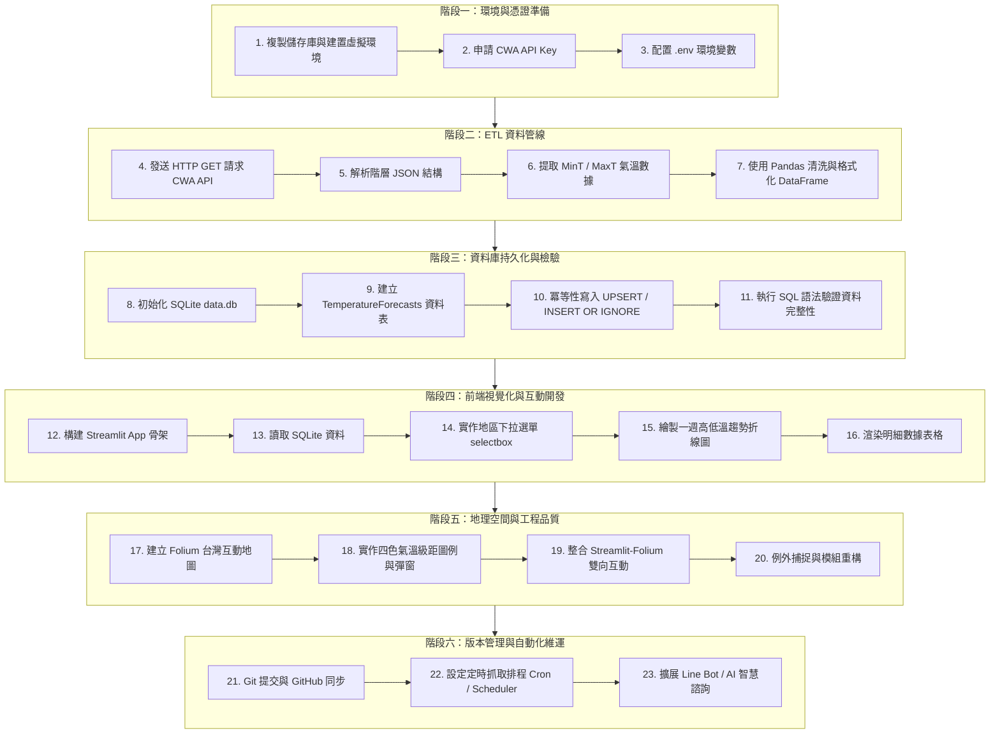
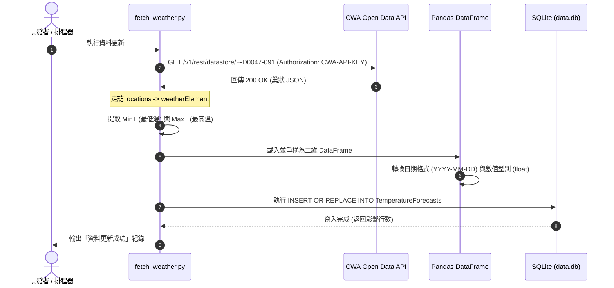

# 🔄 Taiwan Weather Forecast：專案實作工作流程指引 (workflow.md)

> 本文件為 **《AI 創新微課程：Taiwan Weather Forecast》** 的標準作業程序（SOP）與端到端工作流程規範，協助開發者從零構建、維運並擴充這套互動式氣象預報系統。

---

## 🧭 全景工作流程圖 (End-to-End Workflow)



---

## 📋 模組分工與責任矩陣 (Module Responsibility Matrix)

| 檔案名稱 | 核心職責 | 對應課程單元 | 依賴模組 |
| :--- | :--- | :--- | :--- |
| [`.env`](file:///c:/Users/user/Desktop/0923/.env) | 存放私鑰（`CWA_API_KEY`）與環境設定 | 單元 3, 4 | `python-dotenv` |
| [`fetch_weather.py`](file:///c:/Users/user/Desktop/0923/fetch_weather.py) | 呼叫 CWA API、JSON 解析、Pandas 清洗與入庫 (ETL 腳本) | 單元 4 ~ 8, 20 | `requests`, `pandas`, `sqlite3` |
| [`db_manager.py`](file:///c:/Users/user/Desktop/0923/db_manager.py) | 資料庫連線池、Schema 定義、冪等寫入與 SQL 查詢封裝 | 單元 8 ~ 10, 12 | `sqlite3`, `pandas` |
| [`app.py`](file:///c:/Users/user/Desktop/0923/app.py) | Streamlit 主畫面、側邊欄控制項、折線圖與資料表渲染 | 單元 11 ~ 16, 19 | `streamlit`, `pandas` |
| [`map_view.py`](file:///c:/Users/user/Desktop/0923/map_view.py) | Folium 地圖渲染、台灣分區座標定位、氣溫色彩級距對應 | 單元 17 ~ 19 | `folium`, `streamlit-folium` |
| [`scheduler.py`](file:///c:/Users/user/Desktop/0923/scheduler.py) *(選用)* | 定期更新排程（每 6 或 12 小時重新擷取最新預報） | 單元 20, 22 | `schedule` / OS Cron |

---

## 🛠️ 標準作業步驟 (Detailed Step-by-Step SOP)

### 步驟 1：開發環境初始化 (Setup)
1. **建立專案環境**：
   ```bash
   python -m venv venv
   # Windows PowerShell
   .\venv\Scripts\Activate.ps1
   # macOS / Linux
   source venv/bin/activate
   ```
2. **安裝必備依賴庫**：
   ```bash
   pip install --upgrade pip
   pip install -r requirements.txt
   ```
3. **配置金鑰**：
   - 複製 `.env.example` 為 `.env`
   - 至 [中央氣象署氣象資料開放平臺](https://opendata.cwa.gov.tw/) 取得 API Key 並填入：
     ```ini
     CWA_API_KEY=CWA-XXXXXXXXXXXXXXXXXXXXXXXX
     ```

---

### 步驟 2：ETL 資料擷取與清洗流程 (Extract & Transform)



#### 資料結構轉換規格：
- **原始 JSON 路徑**：
  `records -> locations[0] -> location[] -> weatherElement[] -> time[] -> elementValue[0] -> value`
- **目標結構化欄位**：
  | 欄位名稱 | 型別 | 說明 | 範例 |
  | :--- | :--- | :--- | :--- |
  | `regionName` | TEXT | 氣象分區名稱 | `中部地區` |
  | `dataDate` | TEXT | 預報日期 | `2026-04-14` |
  | `minT` | REAL | 最低氣溫 (°C) | `20.0` |
  | `maxT` | REAL | 最高氣溫 (°C) | `30.0` |

---

### 步驟 3：資料庫儲存與防護機制 (Load & Integrity)

為符合**單元 20**所強調之「重複執行不重複插入」與代碼品質，資料表設計與寫入必須具備**冪等性（Idempotency）**：

1. **唯一性約束**：
   以 `(regionName, dataDate)` 為聯合唯一索引（Unique Constraint）。
2. **Upsert 語法**：
   ```sql
   INSERT INTO TemperatureForecasts (regionName, dataDate, minT, maxT)
   VALUES (?, ?, ?, ?)
   ON CONFLICT(regionName, dataDate) DO UPDATE SET
       minT = excluded.minT,
       maxT = excluded.maxT,
       updated_at = CURRENT_TIMESTAMP;
   ```
3. **快速檢驗指令**：
   ```bash
   sqlite3 data.db "SELECT regionName, count(*) FROM TemperatureForecasts GROUP BY regionName;"
   ```

---

### 步驟 4：前端 Streamlit 互動與 GIS 整合 (Presentation & Interaction)

```mermaid
graph LR
    subgraph UI [使用者介面 (UI)]
        R[地區選取 Selectbox]
        D[日期選取 Datepicker]
    end

    subgraph Logic [狀態處理與過濾]
        Filter[Pandas 資料過濾]
    end

    subgraph Views [渲染輸出]
        Chart[一週氣溫走勢圖]
        Table[預報數值清單]
        Map[Folium 台灣動態色塊地圖]
    end

    R --> Filter
    D --> Filter
    Filter --> Chart
    Filter --> Table
    Filter --> Map
```

#### 視覺化溫度級距規範（單元 17）：
| 氣溫範圍 | 色標名稱 | 16 進位色碼 | 呈現意義 |
| :--- | :--- | :--- | :--- |
| `< 20°C` | 舒適偏冷 (藍) | `#2E86AB` | 需注意保暖、攜帶外套 |
| `20°C ~ 25°C` | 宜人舒適 (綠) | `#48A9A6` | 氣溫適中、最適合戶外活動 |
| `25°C ~ 30°C` | 溫暖偏熱 (黃) | `#F4D35E` | 體感微熱、注意防曬補水 |
| `> 30°C` | 炎熱高溫 (紅) | `#EE6055` | 避免正午戶外活動、防中暑 |

---

### 步驟 5：測試與驗證清單 (Verification Checklist)

在將專案交付或推送到 GitHub 前，請依照下表逐項檢核：

- [ ] **API 測試**：執行 `python fetch_weather.py`，確認未拋出 `401 Unauthorized` 或 `404 Not Found`。
- [ ] **資料庫完整性**：確認 `data.db` 檔案已產生，且包含全台至少 6 大分區、未來 7 天之有效數據。
- [ ] **UI 響應性**：執行 `streamlit run app.py`，切換下拉選單時折線圖與表格能毫秒級平滑更新。
- [ ] **地圖點擊**：在地圖點擊標記點，Popup 應正確顯示當前地區之 `MinT` 與 `MaxT`。
- [ ] **機密保護**：確認 `.env` 與 `data.db` 已被列入 `.gitignore`，不得推送到公開 GitHub 庫。

---

## ⏰ 自動化與定期維運流程 (Automation & Maintenance)

氣象局預報每日定時更新，可透過排程工作維護資料庫最新狀態：

### 本地 / 伺服器 Crontab 設定範例：
```bash
# 每日早晨 06:00 與傍晚 18:00 自動執行 ETL 抓取
0 6,18 * * * cd /path/to/0923 && ./venv/bin/python fetch_weather.py >> fetch.log 2>&1
```

### GitHub Actions 定時執行範例 (Workflow CI)：
可設定 `.github/workflows/update_data.yml`，搭配 GitHub Secrets 儲存 `CWA_API_KEY`，實現完全免伺服器的雲端資料更新管線。

---

## 🚀 延伸功能演進路徑 (Extension Roadmap)

```
[目前成果：Taiwan Weather Dashboard]
                │
                ├─► 【Phase 1】整合 Line Messaging API
                │     └─ 每日早晨 07:30 主動發送晨間氣象與穿搭推播
                │
                ├─► 【Phase 2】智慧旅遊路徑推薦
                │     └─ 根據未來 3 天降雨機率與氣溫，動態推薦室內 / 戶外景點
                │
                └─► 【Phase 3】生成式 AI 氣象助理 (Gemini / GPT)
                      └─ 自然語言諮詢：「明天去合歡山需要穿發熱衣嗎？」
```
