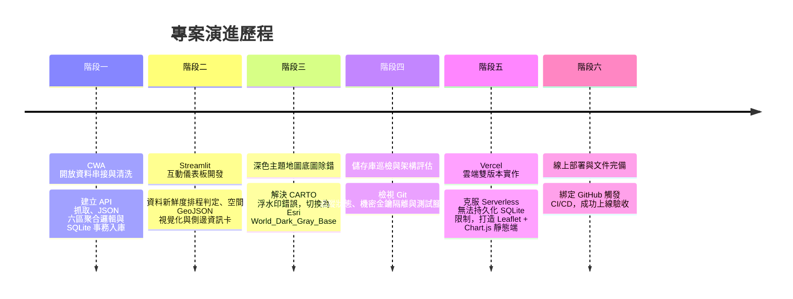
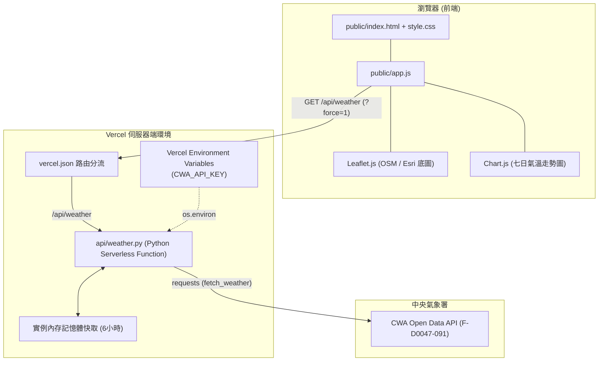

# 🛠️ 臺灣天氣預報應用程式：開發實作與迭代歷程 (workflow.md)

本文件依據**真實開發時序 (Chronological Order)**，詳實記錄「臺灣天氣預報」專案從資料工程、Streamlit 桌面儀表板、地圖底圖除錯，到最終完成 Vercel 雲端 Serverless 部署的完整開發歷程。重點聚焦於各階段遇到的技術瓶頸、權衡考量與具體解法。

---

## 🧭 全景開發時序里程碑 (Development Timeline)



---

## 階段一：資料工程與核心 ETL 管線 (Data Pipeline & ETL)

### 1. 實作重點
- **API 模組 (`fetch_weather.py`)**：串接中央氣象署 Open Data API（現行端點 `F-D0047-091`），並加入 404 自動切換與 SSL 驗證設定，將 API 金鑰嚴密隔離於 `.env` 中。
- **解析與聚合演算法 (`parse_weather.py`)**：
  - 臺灣本島與離島共有 22 縣市，需對應至六大氣象分區（北部、中部、南部、東北部、東部、東南部）。
  - **氣溫 (MinT / MaxT)**：各縣市取當日白日時段最高溫與全日時段最低溫，分區內進行算術平均並保留一位小數。
  - **天氣現象 (Weather)**：類別文字無法數值平均，採用 Python `collections.Counter` 取各縣市白日時段出現頻率最高者（眾數 Mode）作為該區代表。
  - **降雨機率 (PoP)**：過濾「-」無效數據後，進行有效 12 小時降雨機率之整數四捨五入平均。
- **資料庫與事務機制 (`database.py`)**：
  - 設計 `TemperatureForecasts` 主表與 `SyncMetadata` 同步狀態表記錄最後擷取時間。
  - 導入資料庫交易 `with conn:` 與 `ON CONFLICT(...) DO UPDATE`，確保六區資料不齊全時拒絕寫入並即刻 Rollback，防止資料損壞。
- **除錯驗證 (`checkdb.py`)**：撰寫輕量腳本快速驗證南部地區一週數據是否正確落地。

---

## 階段二：Streamlit 互動式應用程式開發 (Streamlit Development)

### 1. 介面架構設計 (`app.py`)
- **緊湊型頂部控制列**：以自訂 CSS 壓縮 Streamlit 預設過大的邊距，整合時間時區顯示（Asia/Taipei）、六小時自動檢查狀態標籤、預報日期下拉選單、分區選單與操作按鈕群。
- **空間地圖作為主視覺**：將 Folium 地圖提升為頁面核心，載入 `taiwan_regions.geojson`，為六大分區配置專屬邊界色，並依各區當日平均氣溫動態標註色塊（藍、綠、黃、紅四級溫標）。
- **側邊收合面板 (Side Panel Drawer)**：採用非對稱欄位排版（`[6, 4]`），當使用者點選地圖區塊或下拉選單選取分區時，展開右側面板顯示該分區專屬的一週氣溫 Matplotlib 折線圖與詳細預報數據表；點擊「✕ 關閉」則平滑恢復全寬地圖。
- **服務層解耦 (`weather_service.py`)**：集中管理資料新鮮度判定（預設 6 小時），避免在 Streamlit 渲染層直接呼叫外部網路 API。

---

## 階段三：深色模式地圖底圖除錯 (Basemap Troubleshooting)

### 1. 遭遇問題
在切換至深色主題時，Folium 地圖的底圖圖磚上持續浮現 **"API KEY REQUIRED"** 的浮水印字樣，影響畫面美觀與使用者體驗。

### 2. 原因分析
原程式碼採用了手動組合的 CARTO dark tile URL：
```python
tiles_param = "https://{s}.basemaps.cartocdn.com/dark_all/{z}/{x}/{y}.png"
```
由於 CARTO 近期變更了公開 Tile 服務的授權政策與子網域路由規則，若缺少 retina 參數或未帶入帳號金鑰，其伺服器會主動回傳帶有浮水印的圖磚。

### 3. 解決方案與迭代
1. **第一次嘗試**：改用 Folium 內建的具名底圖字串 `"CartoDB dark_matter"`，交由 Folium 內部解析標準路徑。
2. **最終確定方案**：依據參考規範，全面改採 **Esri World_Dark_Gray_Base** 公開底圖服務：
   * **底圖 URL**：`https://server.arcgisonline.com/ArcGIS/rest/services/Canvas/World_Dark_Gray_Base/MapServer/tile/{z}/{y}/{x}`
   * **版權字串**：`Tiles &copy; Esri &mdash; Esri, DeLorme, NAVTEQ`
   * **關鍵技術細節**：ArcGIS MapServer 的圖磚路徑格式為 `{z}/{y}/{x}`（**y 在 x 之前**），與標準 OSM `{z}/{x}/{y}` 順序不同。正確設定後，成功消除浮水印，並呈現高品質深灰色暗調底圖。

---

## 階段四：專案檔案審查與維護 (Repository Audit)

為確保專案推送到 GitHub 後結構清晰且無機密外洩風險，對整個目錄進行深度檔案巡檢：

### 1. 檔案用途分類與安全性檢驗
- **安全確認**：確認 `.env` 確實受到 `.gitignore` 規範，未被 Git 追蹤，保護個人 CWA API 授權碼不外洩。
- **開發產物盤點**：
  - `checkdb.py`：確認為開發初期的單次驗證腳本，不影響主程式運作。
  - `weather_raw.json`：確認為 CWA API 原始回應之本地快取，檔案大小約 1.7 MB，已納入備份機制。

### 2. 控制項微調
- 將 Streamlit 主介面的手動更新按鈕文字明確化為 `🔄最新預報`，Tooltip 設定為 `呼叫 CWA API 取得最新預報`，並等比調寬按鈕欄位佔比（`1.1` → `1.8`），防止中文字串在不同螢幕解析度下發生換行斷裂。

---

## 階段五：Vercel 雲端網頁版本實作 (Vercel Serverless Architecture)

### 1. 核心挑戰：Vercel Serverless 的環境限制
- **限制一：無狀態與唯讀檔案系統**：Vercel 函數執行環境屬於短暫性容器 (Ephemeral Containers)，容器重啟後本機磁碟寫入會被重置，無法依靠持久化的本機 SQLite (`data.db`)。
- **限制二：成本與維護性考量**：避免為了單一作業引入額外的付費或複雜外部雲端資料庫（如 Supabase、Neon）。
- **限制三：金鑰不可外洩**：絕對不能將 `CWA_API_KEY` 寫死在前端 JavaScript 中。

### 2. 架構方案決策
採用 **Vercel Python Serverless Function (`api/weather.py`) + 靜態現代化前端 (`public/`)** 的雙層無狀態架構：



### 3. 實作細節
1. **後端函數 (`api/weather.py`)**：
   - 繼承 Python 原生 `http.server.BaseHTTPRequestHandler`，無需引入 Flask 或 FastAPI 額外套件。
   - 動態加入根目錄至 `sys.path`，100% 重用既有的 `fetch_weather.py` 與 `parse_weather.py`。
   - 實作伺服器端實例記憶體快取與 HTTP 標頭控制 (`s-maxage=3600`)；若收到 `?force=1` 則主動向 CWA 發起網路更新。
   - 具備 Cold Start 備援機制：若首次啟動連線異常，自動回退讀取專案內備份之 `weather_raw.json`，確保網站 100% 不破圖。
2. **前端頁面 (`public/index.html`, `style.css`, `app.js`)**：
   - **地圖呈現**：直接使用 **Leaflet.js**（Folium 底層核心），載入 `taiwan_regions.geojson`，支援淺色（OSM）與深色（Esri Dark Gray Base）即時底圖切換。
   - **走勢圖表**：使用 CDN 引入 **Chart.js**，繪製 MaxT (紅) 與 MinT (藍) 雙折線圖，並針對深淺色模式自適應座標軸與網格色彩。
   - **側邊欄抽屜**：透過 CSS Class 切換與 Leaflet 的 `map.invalidateSize()`，實現點擊分區平滑展開資訊面板。
3. **路由規則 (`vercel.json`)**：
   - 配置重寫規則：`/api/(.*)` 路由至 Python Serverless 端點，其餘路徑導向 `public/` 靜態目錄。

---

## 階段六：驗證與成果交付 (Testing & Verification)

### 1. 本地整合驗證結果
- **API 端點驗證**：執行 `python -c "import sys; sys.path.append('api'); import weather; ..."`，確認資料成功聚合為 6 個分區與 7 天預報。
- **強制更新驗證**：傳入 `force=True` 模擬按鈕點擊，驗證成功取得 CWA API 數據並回傳最新時間戳。
- **前端語法驗證**：執行 `node -c public/app.js` 通過語法靜態檢查。
- **儲存庫純淨性**：原有 Streamlit 程式碼 (`app.py`, `database.py` 等) 零變更，維持本機完整功能。

### 2. 最終交付成果
- **GitHub 儲存庫**：保持雙版本架構共存，檔案分類明確。
- **Vercel 線上正式運行網址**：[https://cwahw1-ten.vercel.app/](https://cwahw1-ten.vercel.app/)
