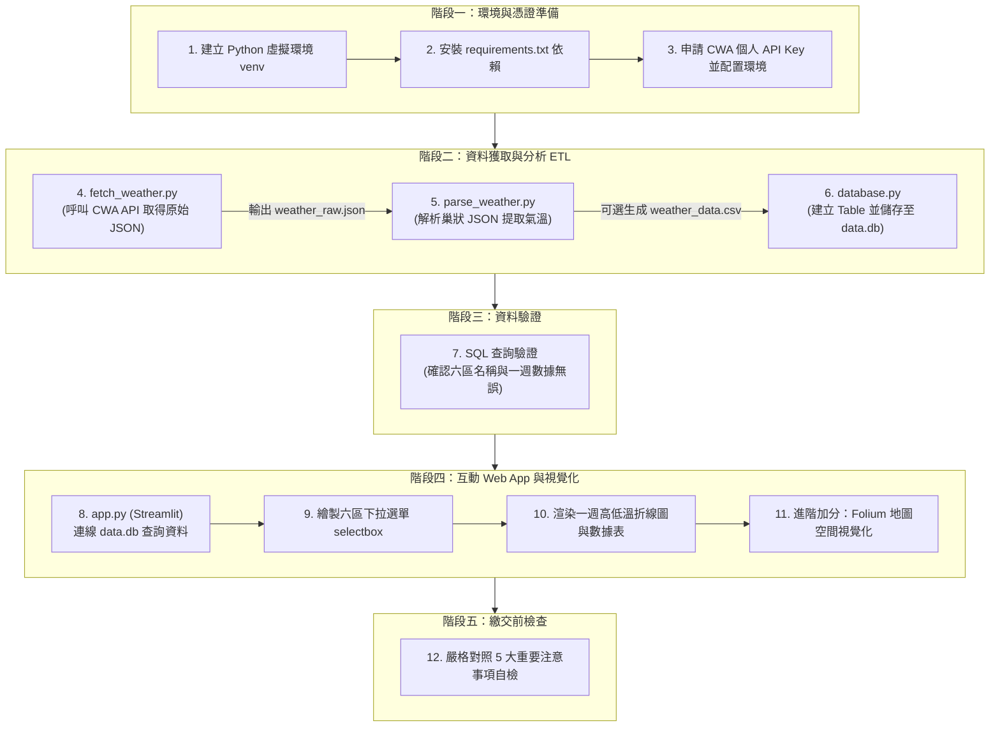
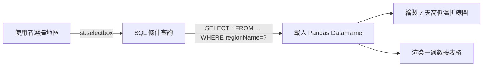

# 🔄 HW10：Taiwan Weather Forecast 作業實作工作流程 (workflow.md)

> 本文件為 **HW10: Taiwan Weather Forecast（從氣象資料到互動式天氣預報應用程式）** 的標準開發與驗收流程指南。依據作業規格書，詳細定義各階段的腳本職責、輸入輸出、執行指令與驗收標準。

---

## 🧭 全景端到端資料與開發管線 (End-to-End Pipeline)



---

## 📂 專案檔案結構與職責分工 (File Structure & Responsibilities)

依照作業規格建議之目錄結構劃分，各檔案分工如下：

```text
HW10_weather/
├── fetch_weather.py      # [任務 1] 呼叫 CWA API 取得六大區域一週天氣預報 JSON
├── parse_weather.py      # [任務 2] 分析 JSON 階層結構，提取各區 MinT 與 MaxT
├── database.py           # [任務 3] 建立 SQLite data.db 與 TemperatureForecasts 資料表
├── app.py                # [任務 4 & 5] Streamlit Web 應用程式 (SQL 查詢 + 圖表 + 地圖)
├── data.db               # [資料庫] SQLite 儲存檔案 (由 database.py 執行產生)
├── weather_data.csv      # [中間產物] (可選) 結構化 CSV 檔案，利於除錯觀察
├── requirements.txt      # [套件依賴] 包含 requests, pandas, streamlit, folium 等
├── .env                  # [私鑰設定] 個人 CWA API Key (不得上傳)
├── .gitignore            # [Git 規範] 忽略 venv/, .env, data.db 等
├── README.md             # [專案說明] 作業成果與功能簡介
└── workflow.md           # [本文件] 作業標準執行與驗收流程
```

---

## 🛠️ 分步實作 SOP 與評分標準對應 (Step-by-Step SOP)

---

### 【任務 1】取得 CWA API 資料 (配分：20%)

- **評分佔比**：取得資料 (10%) ｜ 觀察 JSON (5%) ｜ 程式品質 (5%)
- **目標**：使用 CWA API 取得台灣六大區域一週天氣預報（必須使用 JSON 格式）。
- **目標區域**：`北部地區`、`中部地區`、`南部地區`、`東北部地區`、`東部地區`、`東南部地區`。
- **實作檔案**：[`fetch_weather.py`](file:///c:/Users/user/Desktop/0923/fetch_weather.py)

#### 執行步驟：
1. 使用 `requests` 呼叫中央氣象署 Open Data API（資料集：`F-A0010-001` 或對應一週預報端點）。
2. 在 Request Header 或 Query Params 帶入個人授權碼：`headers = {"Authorization": "YOUR_API_KEY"}`。
3. 使用 `json.dumps(data, indent=2, ensure_ascii=False)` 格式化輸出並觀察結構。
4. 將取得的原始資料暫存為 `weather_raw.json` 或傳遞給解析模組。

#### 核心代碼範例：
```python
import os
import json
import requests
from dotenv import load_dotenv

load_dotenv()
API_KEY = os.getenv("CWA_API_KEY")

url = "https://opendata.cwa.gov.tw/api/v1/rest/datastore/F-A0010-001"
headers = {"Authorization": API_KEY}

resp = requests.get(url, headers=headers, timeout=30)
if resp.status_code == 200:
    data = resp.json()
    print("✅ 資料取得成功！")
    with open("weather_raw.json", "w", encoding="utf-8") as f:
        json.dump(data, f, ensure_ascii=False, indent=2)
else:
    print(f"❌ 取得失敗，狀態碼：{resp.status_code}")
```

---

### 【任務 2】分析 JSON，提取氣溫資料 (配分：20%)

- **評分佔比**：提取正確 (10%) ｜ 觀察資料 (5%) ｜ 程式品質 (5%)
- **目標**：剖析 JSON 結構，找出並提取每日最高溫 (`MaxT`) 與最低溫 (`MinT`)。
- **實作檔案**：[`parse_weather.py`](file:///c:/Users/user/Desktop/0923/parse_weather.py)

#### JSON 階層路徑剖析：
```text
JSON (root)
└── records
    └── locations
        └── location[] (六大分區)
            └── weatherElement[] (天氣要素)
                └── time[] (預報日期區間)
                    ├── elementName: "MinT" (最低溫)
                    └── elementName: "MaxT" (最高溫)
```

#### 萃取結果標準格式：
| regionName | dataDate | mint | maxt |
| :--- | :---: | :---: | :---: |
| 北部地區 | 2026-04-14 | 18 | 26 |
| 中部地區 | 2026-04-14 | 20 | 30 |
| 南部地區 | 2026-04-14 | 22 | 31 |

- **驗收要點**：
  - 將提取後的結果轉為結構化的 List of Dicts 或 Pandas DataFrame。
  - （可選）輸出為 `weather_data.csv`，方便檢視 7 天數據是否完整連續。

---

### 【任務 3】存入 SQLite 資料庫 (配分：20%)

- **評分佔比**：儲存資料 (10%) ｜ 查詢驗證 (5%) ｜ 程式品質 (5%)
- **目標**：將清洗好的六大區一週氣溫資料存入 SQLite 資料庫。
- **實作檔案**：[`database.py`](file:///c:/Users/user/Desktop/0923/database.py)

#### 資料表結構（嚴格依照作業規格定義）：
```sql
CREATE TABLE IF NOT EXISTS TemperatureForecasts (
    id INTEGER PRIMARY KEY AUTOINCREMENT,
    regionName TEXT NOT NULL,
    dataDate TEXT NOT NULL,
    mint REAL NOT NULL,
    maxt REAL NOT NULL
);
```

#### 驗收與查詢驗證步驟：
在 Python 腳本或 SQLite CLI 執行下列驗證 SQL，確保寫入無誤：

```python
import sqlite3

conn = sqlite3.connect("data.db")
cursor = conn.cursor()

# 驗證 1：列出所有地區名稱（確認涵蓋 6 個地區）
cursor.execute("SELECT DISTINCT regionName FROM TemperatureForecasts;")
regions = cursor.fetchall()
print("現有分區：", [r[0] for r in regions])

# 驗證 2：查詢中部地區資料（確認至少有 7 天資料）
cursor.execute("SELECT * FROM TemperatureForecasts WHERE regionName = '中部地區';")
rows = cursor.fetchall()
for r in rows:
    print(r)

conn.close()
```

---

### 【任務 4】Streamlit 氣溫預報 Web App (配分：40%)

- **評分佔比**：下拉選單 (10%) ｜ 折線圖與表格 (15%) ｜ SQLite 查詢 (10%) ｜ 程式品質 (5%)
- **核心約束**：**Streamlit 必須從 SQLite (`data.db`) 查詢資料，嚴禁在 Streamlit 中直接呼叫 CWA API**。
- **實作檔案**：[`app.py`](file:///c:/Users/user/Desktop/0923/app.py)

#### 功能開發 SOP：


1. **連線資料庫並讀取地區清單**：
   ```python
   conn = sqlite3.connect("data.db")
   regions_df = pd.read_sql_query("SELECT DISTINCT regionName FROM TemperatureForecasts", conn)
   selected_region = st.selectbox("Select Region", regions_df["regionName"])
   ```
2. **依選定地區取得該區一週預報**：
   ```python
   query = "SELECT dataDate as Date, mint as MinT, maxt as MaxT FROM TemperatureForecasts WHERE regionName = ?"
   df = pd.read_sql_query(query, conn, params=(selected_region,))
   ```
3. **繪製折線圖**：
   - X 軸：預報日期 (04/14 ~ 04/20)。
   - Y 軸：溫度 (°C)。
   - 雙折線：最高溫 (MaxT) 與最低溫 (MinT)。
4. **顯示一週資料表格**：
   - 呈現 `Date`、`MinT`、`MaxT`。

---

### 【任務 5】進階：台灣地圖視覺化 (加分項目 Optional)

- **目標**：製作互動式台灣地圖，依據各地區當日**平均溫度**設定顏色標記。
- **技術方案**：`folium` + `streamlit-folium`
- **實作檔案**：整合於 [`app.py`](file:///c:/Users/user/Desktop/0923/app.py)

#### 均溫色彩標準對應表：
| 氣溫區間 | 標記代表色 | 視覺意義 |
| :---: | :---: | :--- |
| `< 20°C` | 藍色 (`#2E86AB`) | 寒冷 / 偏涼 |
| `20°C ~ 25°C` | 綠色 (`#48A9A6`) | 宜人舒適 |
| `25°C ~ 30°C` | 黃色 (`#F4D35E`) | 溫暖偏熱 |
| `> 30°C` | 紅色 (`#EE6055`) | 高溫炎熱 |

#### 互動彈窗 (Popup) 內容規範：
- 地區名稱（例：`中部地區`）
- 日期（例：`2026-04-14`）
- 最低溫（例：`Min: 20°C`）
- 最高溫（例：`Max: 30°C`）

---

## ⚡ 完整執行指令順序 (Execution Steps)

作業的完整重現順序如下：

```bash
# 1. 建立虛擬環境 (建議)
python -m venv venv

# Windows
venv\Scripts\activate
# Mac / Linux
source venv/bin/activate

# 2. 安裝必要套件
pip install -r requirements.txt

# 3. 執行資料處理管線 (一次即可)
python fetch_weather.py
python parse_weather.py
python database.py

# 4. 啟動互動式 Web App
streamlit run app.py
```

---

## 🚨 繳交前自我檢核清單 (Self-Inspection Checklist)

依據作業右下角之「**重要注意事項**」，繳交前請逐項打勾確認：

- [ ] **① 使用自己的 CWA API Key**：已在 `.env` 中設定自己的授權碼，絕未使用教師或同學的金鑰。
- [ ] **② Streamlit 必須從 SQLite 查詢資料**：`app.py` 內僅包含 `sqlite3` 查詢，**沒有**任何呼叫 CWA API 的 `requests.get()` 語法。
- [ ] **③ 六大區域齊全**：執行 `SELECT DISTINCT regionName`，確認包含：北部地區、中部地區、南部地區、東北部地區、東部地區、東南部地區。
- [ ] **④ 週期完整（7 天）**：每個分區的預報資料皆涵蓋連續一週（7 筆），折線圖與表格完整呈現。
- [ ] **⑤ 加分功能順序**：已確保 1 ~ 4 項基本功能穩定無誤，地圖呈現作為額外亮點加分項。
- [ ] **⑥ 機密資料隔離**：`.gitignore` 檔案已正確加入 `.env` 與 `data.db`，避免個人金鑰洩漏至 GitHub。

---

*用程式連結真實世界，讓資料說出天氣的故事！*
